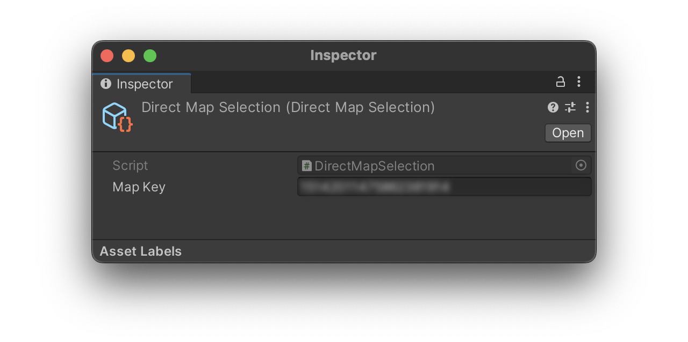

# Heatmap

Move your device across the location of a scanned app and relocalize
successfully with the help of the Heatmap.

This sample makes usage of the RelocManager from the previous sample in order to
obtain the relocalization score and draw in a colored scale, from the minimum
value represented with green to red which are the hotter areas until you
finally relocalize.

    

## Requirements and Setup

- [Project Setup](../../../README.md#project-setup)

- From the [Developer Console](https://developers.pretiaar.com/register) select
a map, then copy and paste its Map Key into the
`HeatMap/Settings/DirectMapSelection` scriptable object.

## High-lights

### DirectMapSelection

The DirectMapSelection asset indicates to the
ARSharedAnchorManager component which specific map
should be look for relocalization.

### HeatMapSphereLocator

This component locates the game object it is attached to, at the location of
the target AR Camera. It also sends an update of its current location to the
OnSphereTranslate event subscribers.

### HeatMapSphereColorizer

Subscribed to the RelocManager and the HeatMapSphereLocator this component
updates, on each OnScoreUpdated and OnSphereTranslate events, the weights on
affected vertexes of a spherical polygon that encloses the camera. Finally the
colors of each vertex are changed with the weights information on each
LateUpdate.