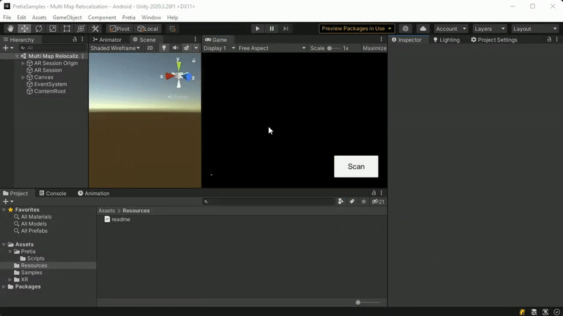
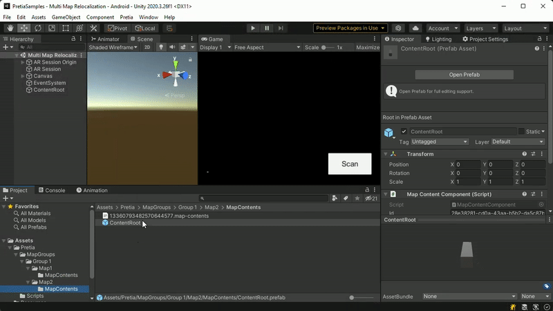
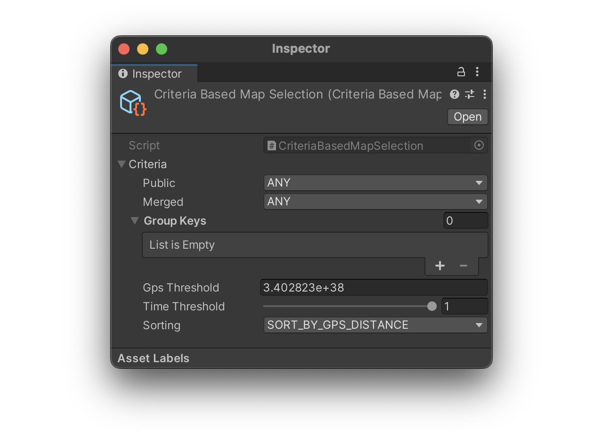

# Multi Map Relocalization

This sample will use the map-based relocalization to find the closest GPS
shared anchor and is designed to work hand in hand with the
[Content Authoring System](https://docs.developers.pretiaar.com/tutorials/content-authoring/),
in order to align content, and use as a basis for these prefabs.

## Requirements and Setup

### Relocalization

- [Project Setup](../../../README.md#project-setup)

- For relocalization this sample needs multiple scanned maps assigned to the App.
You can also check the
[Create New Map](https://docs.developers.pretiaar.com/3d-scanner-app/create-new-map)
guide for further reading about how to create a new map.

### Content Authoring

1. Add content to an existing map using the
   [Content Authoring System](https://docs.developers.pretiaar.com/tutorials/content-authoring/).

    
    

2. Download the map content to your unity project from the Map Download tool at
   the Pretia menu in the top bar menu.

3. Select the created ContentRoot prefabs and rename them as the
   Map Keys of the maps associated with your application, for which you want to display
   content.

4. Locate the prefabs into the Resources folder.
5. Build the project.

    
    

## High-lights

### CriteriaBasedMapSelection

This scriptable object, which is assigned to the MapSelection field of the
ARSharedAnchorManager component, is the one responsible of filtering and get the
closest Map for relocalization.

### RelocManager

The Reloc Manager class starts, stops and handles OnMapRelocalized events of
the ARSharedAnchorManager.

### MapContentDownloader

Subscribed to the Reloc Manager this class will instantiate content from the
Resources path when relocalization succeeds. This class also
handles anchoring of the content after instantiation, so that content will
remain in place when relocalizing to a different location.

