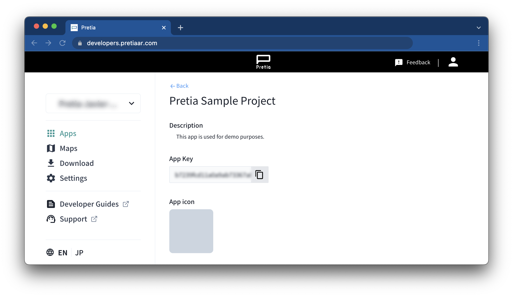
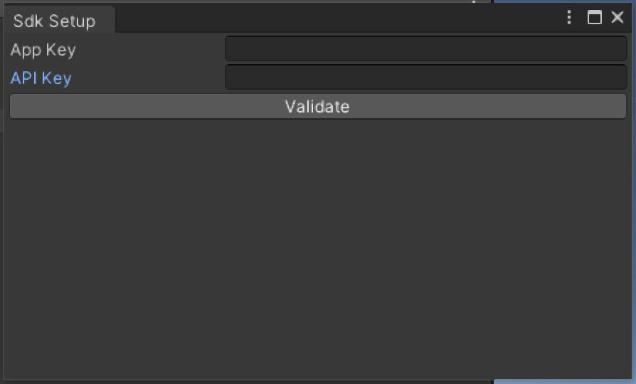

# Introduction

This repository contains samples that demonstrates the usage of the Pretia AR 
Cloud. Please read through the 
[documentation guide](https://docs.developers.pretiaar.com/) for API 
understanding, find tutorials and further readings.

## About Pretia AR Cloud

Pretia AR Cloud is a platform containing a suite of products that helps 
developers create shared AR experiences.

The underlying technology uses “spatial maps” of a location which are created 
by scanning a space using a scanner app. Developers can put their AR contents 
into these scanned maps with Unity and use them in their apps. For managing 
maps and creating apps using our SDK, we also offer a platform called the 
Developer Console. Please refer to the 
[AR Cloud Architecture](https://docs.developers.pretiaar.com/api) 
for details.

Thus, Pretia AR Cloud consists of three major products:

* Pretia SDK - Unity SDK for developing shared AR experiences using our cloud services. Currently, we support building Android and iOS apps with our SDK.
* Developer Console - A web-app for managing the scanned maps, and their usages in your apps.
* 3D Scanner App - A mobile app for scanning a location to create maps, and placing AR contents, you can download the 3D Scanner App from the [Developer Console](https://developers.pretiaar.com).

## Project Setup

The following instructions will guide you to set up and use this project. Please note that this project has been developed with the Unity version 2020.3.36f1 LTS.

1. Clone or download this repository and open it using Unity 2020.3.36f1 LTS.
2. If you don't have a Pretia AR Cloud account please create one at our [Developer Console](https://developers.pretiaar.com/register) and add new application.
3. Click on your app's icon and copy the App Key.

4. In Unity, at the top bar menu click at `Pretia/SDK Setup` paste your App Key and login in to enable the usage of the Pretia SDK.

